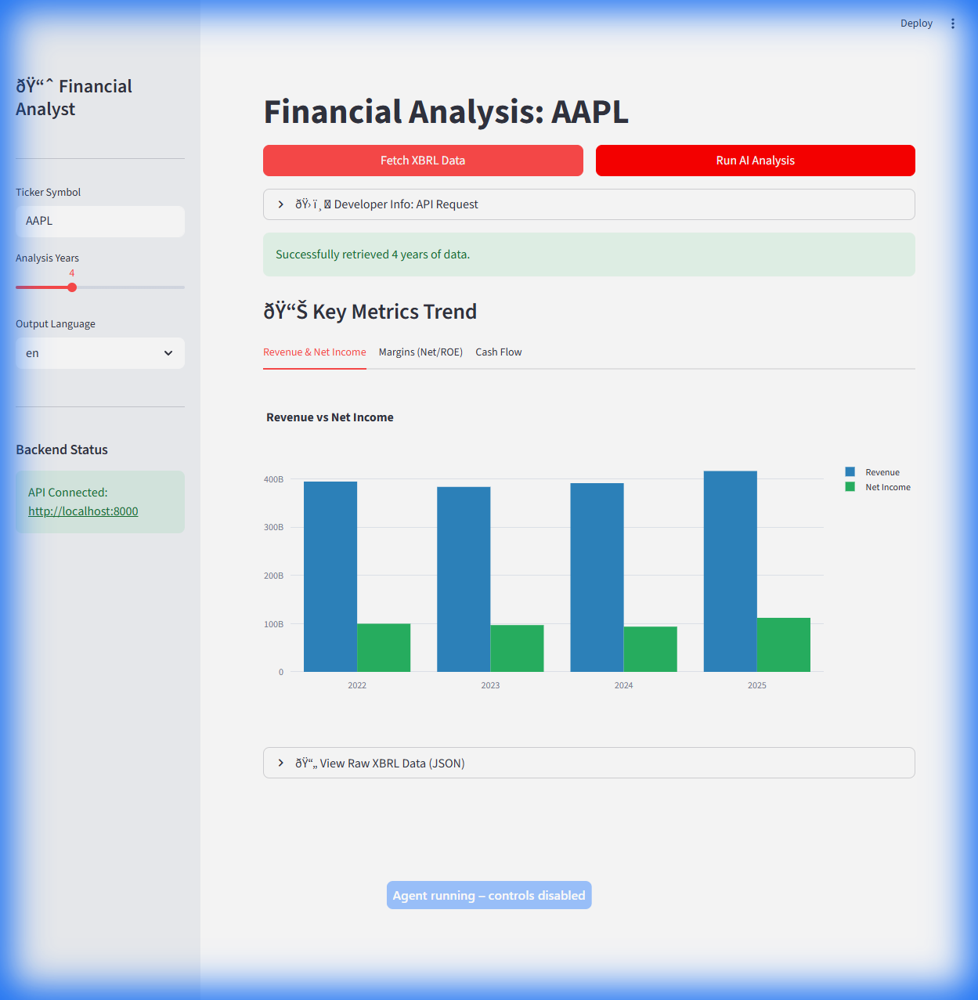

# SEC XBRL AI Analyst (v1.0 MVP Ready)

**The Developer-First Financial Analysis Engine.**  
Fetch accurate SEC XBRL data, visualize financial trends, and generate AI-powered investment memos running 100% locally.

**Status**: v1.0 MVP Complete. Ready for distribution and sale.



## What is this?

This is a production-ready API and UI toolkit designed for **Developers** and **Financial Analysts**.
It automates the boring parts of financial research:

1. **Ingests Financial Data**: Fetches "Company Facts" (XBRL) directly from the SEC EDGAR API.
2. **Calculates Metrics**: Automatically computes Revenue, Net Income, Margins, FCF, ROE, and CAGR.
3. **Generates Insights**: Uses local LLMs (via **Ollama**) to write professional financial reports like a junior analyst.
4. **Runs Everywhere**: Fully containerized with Docker Compose.

**Stack**: FastAPI, Streamlit, Pandas, Plotly, Ollama.

## Features

- **Real-Time SEC Data**: No stale databases. Fetches directly from the source.
- **Smart Year Parsing**: Prioritizes Calendar Year (CY) frames for accuracy.
- **Multi-Language AI**: Supports generating reports in **English** or **Japanese** (Selectable).
- **Privacy First**: Your financial queries never leave your machine (Local LLM).
- **Developer Ready**: Clean REST API with Swagger docs.
- **Instant UI**: Streamlit dashboard included for demos.

---

## Quickstart (Docker)

The recommended way to run the full stack (API + UI).

### Prerequisites

1. **Docker Desktop** (running).
2. **Ollama** (running on host).

    ```powershell
    ollama serve
    ollama pull qwen2.5:7b
    ```

### Run

1. **Configure**: Copy `.env.example` to `.env`.
    *Critical: Set `SEC_USER_AGENT=Name contact@email.com` (SEC Requirement).*

2. **Launch**:

    ```powershell
    docker compose up --build
    ```

3. **Access**:
    - **Dashboard**: [http://localhost:8501](http://localhost:8501)
    - **API Docs**: [http://localhost:8000/docs](http://localhost:8000/docs)

---

## Developer Guide (API)

You can use the API directly without the UI.

### 1. Get Financial Metrics

Returns standardized XBRL data table.

```bash
# PowerShell (curl.exe)
curl.exe "http://127.0.0.1:8000/sec/xbrl/metrics?ticker=NVDA&years=4"
```

### 2. Generate AI Report

Passes metrics to LLM for analysis. Support `output_lang` ("en" or "ja").

```powershell
# PowerShell
Invoke-RestMethod -Uri "http://127.0.0.1:8000/ai/analyze/xbrl" `
  -Method Post `
  -ContentType "application/json" `
  -Body '{"ticker": "AAPL", "years": 4, "output_lang": "en"}'
```

**Response (JSON)**:

```json
{
  "executive_summary": "AAPL has shown consistent revenue growth...",
  "key_metrics_commentary": "Net margin of 25% indicates strong...",
  "risks_summary": "Potential regulatory headwinds..."
}
```

---

## Verification

We include scripts to check your deployment.

**Docker Verification**:

```powershell
./scripts/verify_docker_mvp.ps1
```

**Local (Windows) Quick Test**:

```powershell
curl.exe "http://127.0.0.1:8000/health"
```

---

## Disclaimer

This software aggregates public data from the SEC. It is for informational purposes only and does **not** constitute investment advice.
